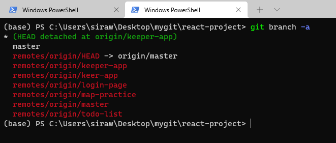
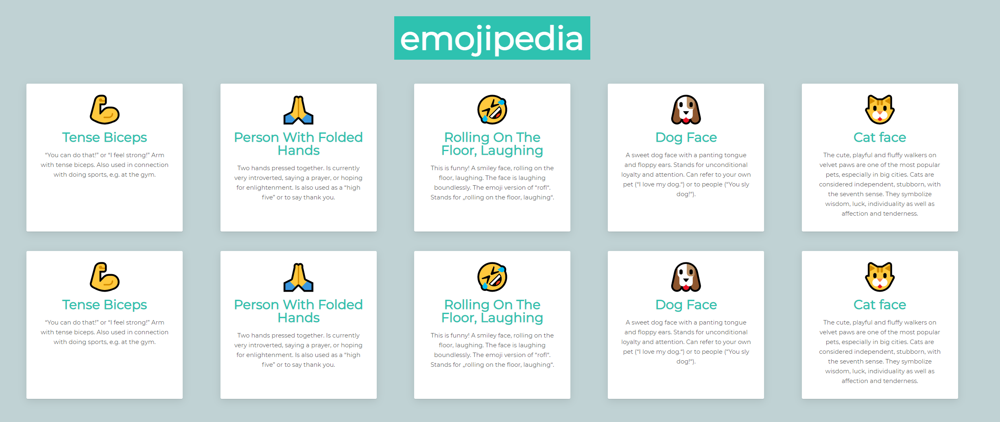
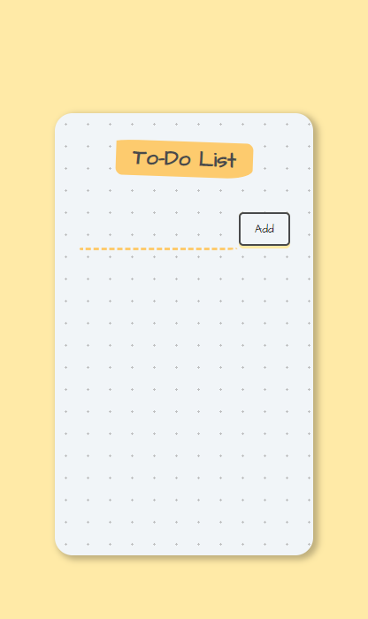
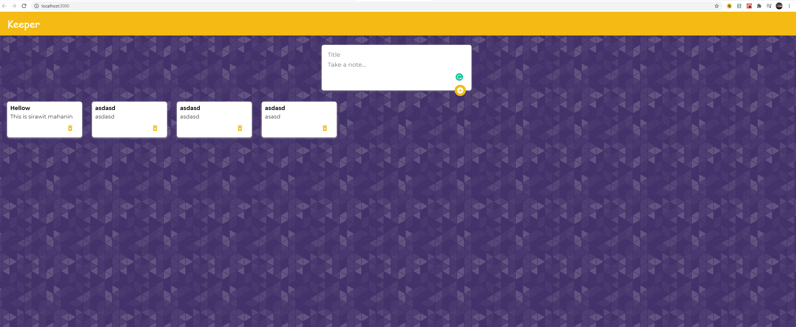

# Description 😍

This is a collection of React projects I've learned from [Udemy](https://www.udemy.com/course/the-complete-web-development-bootcamp/).

## Instructions 👆
In the project directory, you can run:
#### `npm install`
then
#### `npm start`
(No database needed)
 

## List of projects 😊
#### `git branch -a`

### 1. Emojipedia (practice how to use map function)
#### `git checkout origin/map-practice`

### 2. To-do list
#### `git checkout origin/todo-list`

### 3. Keeper app
#### `git checkout origin/keeper-app`
(Must have material-ui installed with `npm install @material-ui/core`)

